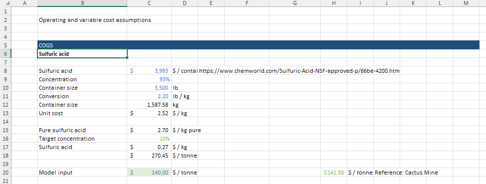
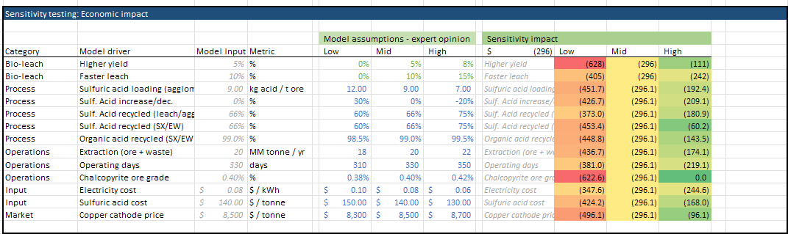
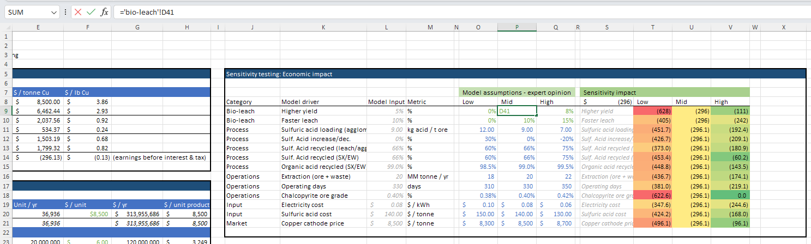
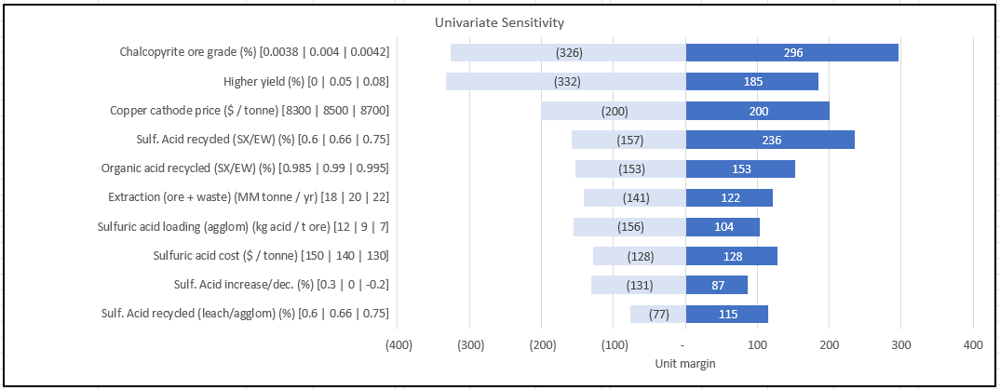
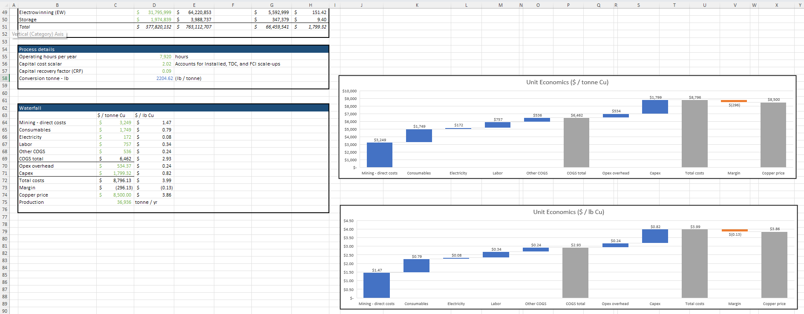

# Cost Assumption Analysis

## Objectives for this Example
- Learn how to modify cost assumptions in a TEA model
- Evaluate the impact of cost changes on project economics
- Understand how to use sensitivity analysis tools to inform decision-making

## Background
Cost assumptions significantly influence techno-economic analysis results. This example demonstrates how to thoughtfully adjust cost inputs and analyze their impacts on project economics.

## Step-by-Step Guide

### 1. The Two Methods for Changing Cost Assumptions

You can modify cost assumptions in two ways:

**Method 1: Changing values in the "variable" tab**

- Setting the values there sets the base case scenario
- Provides space to provide justification & references
- Also space for team commentary

??? example "View Variable Tab Example"
    

**Method 2: Adjusting sensitivity parameters in the "dashboard" tab**

- Modifies the low/medium/high cases for sensitivity analysis
- Helps understand the impact of cost variability
- Can change the baseline and other scenarios

??? example "View Sensitivity Table"
    

### 2. Method 1: Changing Cost Assumptions in the "Variable" Tab

#### A. Navigate to the "variable" sheet
This sheet contains all input parameters including costs for reagents, energy, labor, and other operational inputs.

#### B. Identify the cost you want to modify
Costs are organized by category (reagents, utilities, labor, etc.), and a couple of examples are included.

#### C. Research and cite reference values
When changing a cost assumption:

1. Research reliable sources for cost data:
   - Industry reports
   - Academic publications
   - Vendor quotes
   - Government databases

2. Document your sources
    - This is useful both for your team as well as third parties, investors, partners who want to understand where numbers come from

#### D. Handling multiple reference values
When multiple cost references exist for an input:

| Approach | When to Use | Implementation |
|----------|-------------|----------------|
| Average value | When references are similar and reliable | Calculate and use the mean of available values |
| Single reference | When one source is most relevant to your case | Choose the most applicable data point |
| Range in sensitivity | When significant uncertainty exists | Use the range in your low/med/high inputs |

#### E. Update the "Dashboard" sensitivity table
Make sure the 'med' datapoint references the value in the variable sheet, so it properly pulls from the assumption you just set

??? example "View Dashboard Reference Example"
    

#### Illustrative Example:
For sulfuric acid cost, you might find:

- Source 1: $0.10/kg (US Gulf Coast, 2022)
- Source 2: $0.13/kg (European average, 2023)
- Source 3: $0.08/kg (Global commodity report, 2021)

Decision: Use $0.10/kg as base case (Source 1) with $0.08-0.13/kg as sensitivity range.

### 3. Method 2: Changing Sensitivity Assumptions in the "Dashboard" Tab

#### A. Navigate to the "dashboard" sheet
This sheet contains sensitivity parameters and visualization tools.

#### B. Locate the sensitivity inputs section
Find the area where low/medium/high values are defined for key parameters.

#### C. Adjust sensitivity parameters using one of these approaches:

1. **Manual setting:**
    - Directly enter specific values based on research
    - Example: Set sulfuric acid costs to $0.08/kg (low), $0.10/kg (medium), and $0.13/kg (high)

2. **Factor-based adjustment:**
    - Apply consistent multipliers to the medium (base) case
    - Example: Set factors to ±20% → $0.08/kg (low), $0.10/kg (medium), and $0.12/kg (high)

??? example "View Sensitivity Table Configuration"
    

#### D. Document your approach
Add notes explaining your rationale for the sensitivity ranges chosen in the "Dashboard" or "Variable" tab

### 4. Evaluating the Impact of Cost Changes

After modifying cost assumptions, evaluate the impact on project economics:

#### A. Sensitivity Analysis
1. Navigate to the sensitivity analysis section on the dashboard
2. Observe how economics or process flow metrics change across different scenarios
3. Identify which inputs have the greatest impact on outcomes

#### B. Tornado Chart Analysis
1. Locate the tornado chart on the dashboard
2. Examine which variables create the widest bars (highest impact)
3. Focus refinement efforts on high-impact variables

??? example "View Tornado Chart Example"
    

#### C. Interpret Results
- Wider bars indicate parameters with higher economic leverage
- Asymmetric bars suggest non-linear relationships
- Direction shows positive or negative correlation with profitability (or whichever metric you've set)

### 5. Exercise: "Zero-Cost" Impact Analysis

A valuable exercise is to explore the impact if certain inputs were free:

#### A. Select a key input cost
Choose an input with significant cost contribution.

#### B. Set the cost to zero in the "variable" tab
This simulates a scenario where this input is free or self-generated.

#### C. Evaluate impact on unit economics
1. Note the change in total production cost
2. Calculate the percentage improvement in economics

#### D. Analyze the waterfall chart
1. Locate the waterfall chart at the bottom of the dashboard
2. The segment corresponding to your zeroed input represents its economic impact
3. Compare this to other cost components to prioritize cost reduction efforts

??? example "View Waterfall Chart Example"
    
