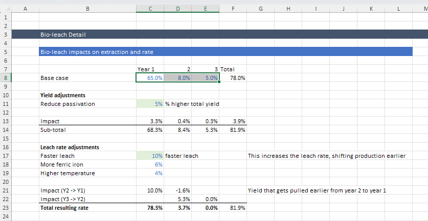
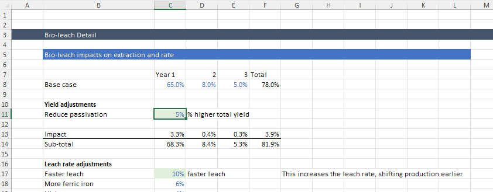
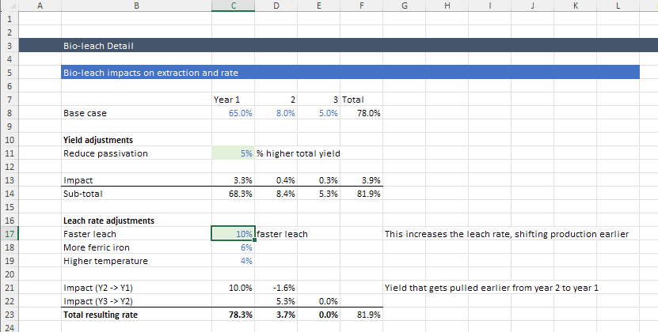
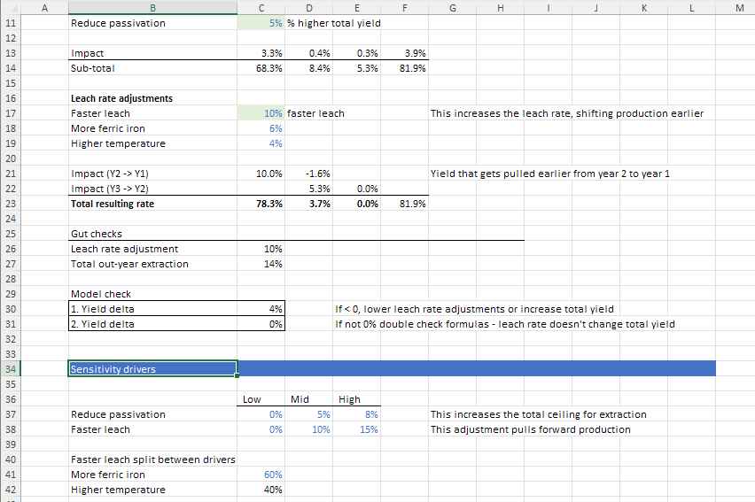

# Bioleach Recovery Rate Analysis

## Objectives for this Example
- Understand how bioleach parameters affect overall project economics
- Learn to conduct sensitivity analysis on recovery parameters
- Connect technological improvements to financial outcomes

## Background
Bioleaching performance is a critical driver of project economics. Enhanced microbial activity can increase both:

- **Total yield** (reducing passivation effects)
- **Leach rate** (accelerating copper recovery)

## Step-by-Step Guide

### 1. Navigate to the "bioleach" sheet
Find this sheet in the bottom tab navigation of the TEA model.

### 2. Examine the baseline parameters
   
#### A. Recovery rate per year
This shows the expected copper recovery timeline without biological enhancements.
   
??? example "View Recovery Rate Parameter"
    

#### B. Yield impact 
This parameter represents how bioleaching affects total recoverable copper.
   
??? example "View Yield Impact Settings"
    

#### C. Leach rate impact
This shows how bioleaching accelerates copper recovery timing.
   
??? example "View Leach Rate Impact Parameters"
    

### 3. Set up scenario analysis

#### For each scenario:
1. Enter the values in the sensitivity driver section
2. See how it affects the copper recovery by year above
3. See if there are any errors or issues that get raised

??? example "View Test Assumption Interface"
    

### 4. Analyze economic impacts

For each scenario, navigate to the "dashboard" sheet and observe:

- **Revenue impact**: Higher copper recovery → increased sales
- **CAPEX implications**: Faster recovery → smaller heap footprint
- **OPEX tradeoffs**: Enhanced biology costs vs. reduced acid consumption
- **Net income change**: Overall economic effect
