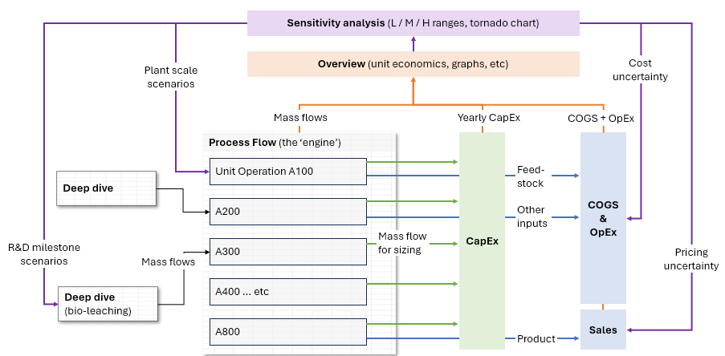
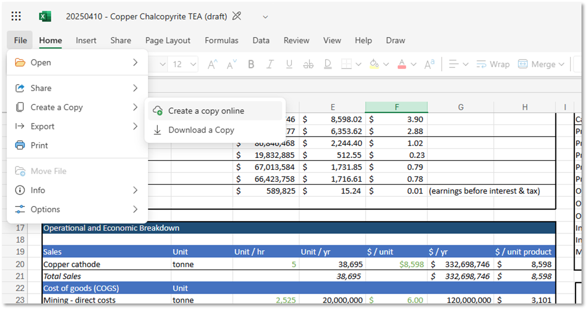
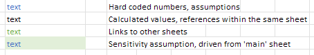

# Getting Started
Based on our experience working with TEAs, we suggest:

1. **Skim this entire manual before beginning to work through the examples**
2. Ground yourself in the process flow first ("PFD", "process", and "bioleach" sheets) - understand inputs, outputs, and core unit operations
3. Review the economic overview to identify which costs or levers drive the economic "story"
4. Understand the sensitivity levers - their ranges and the hypotheses they test
5. Review the tornado chart to visualize sensitivity impacts on unit economics
6. Step through the process flow from top to bottom to understand the sources of different assumptions
7. Consider how the model can be useful for your purposes - whether as a gut-check or as a foundation for your own analysis

## Model Layout

The model is organized into several sections:

??? example "Here's our mental model of how it's laid out"
    

1. **Dashboard**: Main summary and control panel for understanding overall economics and adjusting sensitivities (except for bioleaching assumptions)
2. **Process Flow**:
    - "Process" - The main engine tracking all mass and energy flows
    - "Bioleach" - Tracks assumptions, purposefully generalized for teams to embed their own parameters
    - "PFD" - Set of unit operations for our illustrative example
3. **Economic Assumptions**:
    - "Variable" - Variable costs (both COGS and OpEx)
    - "CapEx" - Capital expenditures for each unit operation, with framework to aggregate and annualize costs
    - "Sales" - Assumptions on copper pricing
4. **Utilities**:
    - "Tornado" - Excel formulas driving the tornado chart visualization
    - "Validation" - Tracking comparisons across mining-related reference models from public sources 

## Accessing the Model

The model is hosted on Microsoft OneDrive as an online Excel file

- To edit: Go to File → Create a Copy → Create a Copy Online to utilize the sensitivity analysis features. You can also download a copy of the model and directly edit that copy.

    ??? example "Create a copy online or download directly"
        
    
- Note: you'll need to use or [create](https://account.microsoft.com/account/Account) a Microsoft account to create a version for yourself
- We chose Excel over Google Sheets for its more robust formula support. If converted into Google Sheets, the model will not function entirely as designed.

## For Those Learning TEA

If you're new to techno-economic analysis, we recommend exploring these additional resources that come with video guides, rich databases of templates, data, and more:

1. University of Michigan AssessCCUS ([resource link](https://assessccus.globalco2initiative.org/tea/))
2. Activate - TEA guide and example templates ([resource link](https://www.activate.org/techonomics))
- You'll see that different numeric assumptions are color-coded differently. We similarly use best practices adopted by finance and accounting analysts for building easy-to-audit models. (example [here](https://www.wallstreetprep.com/knowledge/financial-modeling/))
   
    ??? example "View color coding example"
        
    

