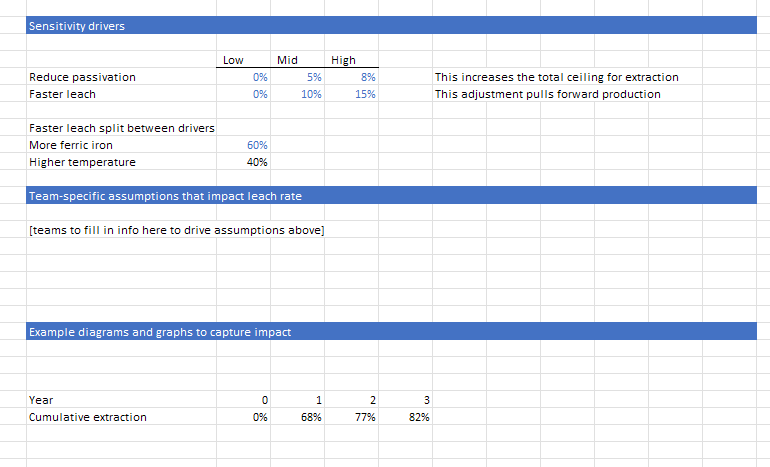

# Scope Overview: Chalcopyrite Bioleaching

We model an illustrative chalcopyrite extraction and processing operation based on industry references, expertise, and input from across the ecosystem of mining operators and researchers.

## Why Chalcopyrite?

- Offers significant decarbonization impact, especially related to electrification
- Represents a massive market opportunity, accounting for 70-80% of copper reserves ([ref](https://link.springer.com/article/10.1007/s11837-005-0252-5))
- With declining ore grades globally, low-grade copper ores are becoming increasingly economic options for industrial-scale mining operations ([ref](https://www.spglobal.com/market-intelligence/en/news-insights/research/copper-project-pipeline-project-shortage-to-see-supply-lag-demand-post-2025))
- Biology has historically played a major role in the recovery of copper from low-grade chalcopyrite

## Focus on Heap Leaching

Heap leaching is the most cost-effective way to process low-grade ore, with high operational expenses primarily from acid use to dissolve copper from refractory rock. This is a prime area where biological processes can be applied to improve efficiency and reduce costs.

## Unit Operations in Our Model

The operation includes the following unit operations:

1. **Ore Extraction**: The initial mining process of removing copper-bearing ore from the ground through drilling, blasting, and excavation methods.
2. **Crushing & Screening**: Size reduction of large ore pieces to optimal dimensions for leaching, typically through multiple crushing stages and screening to separate particles by size.
3. **Agglomeration**: Mixing of crushed ore with acid and sometimes binding agents to create uniformly sized particles that promote better leach solution percolation. This is also where microbes are often introduced in industrial operations to the agglomerated ore flow.
4. **Stacking**: Placement of the agglomerated ore onto prepared leach pads in layers designed to optimize solution flow and minimize compaction.
5. **Leach Cycle**: The core process where acid solution (modified with microbes or additives) percolates through the heap to dissolve copper from the ore over a period of months.
6. **Solvent Extraction**: Chemical process that selectively removes and concentrates copper from the leach solution (pregnant leach solution) into an electrolyte solution.
7. **Electrowinning**: Electrochemical process where copper is plated onto cathodes from the concentrated solution, producing copper metal with 99.99% purity.
8. **Copper Cathode Storage**: Final handling and storage of copper cathode sheets before shipping to customers.

We also include a small unit operation placeholder for the biotech input - depending on application, this could be specialized microbes, bioproducts, or additives that impact the microbial community within heap leaches. 

??? example "Go to the 'bioleach' tab for more details"
    

## Scope Boundaries

While we model the entire process, our focus is primarily on the leaching process, with illustrative placeholders for other unit operations based on industry data. Extraction, though critical to the end-to-end process, is outside our detailed parameterization scope.

We assume all copper production is focused on copper cathode - the main commodity and transferrable unit for copper. 
