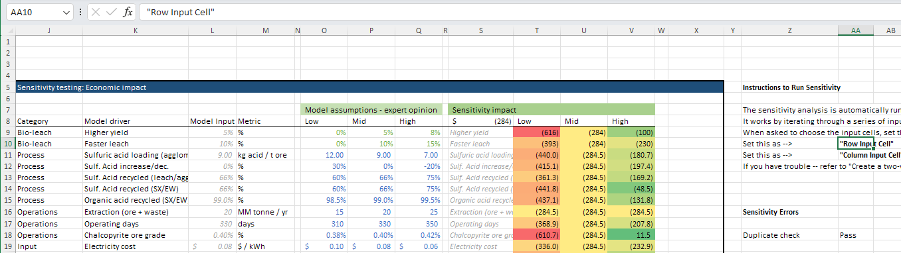
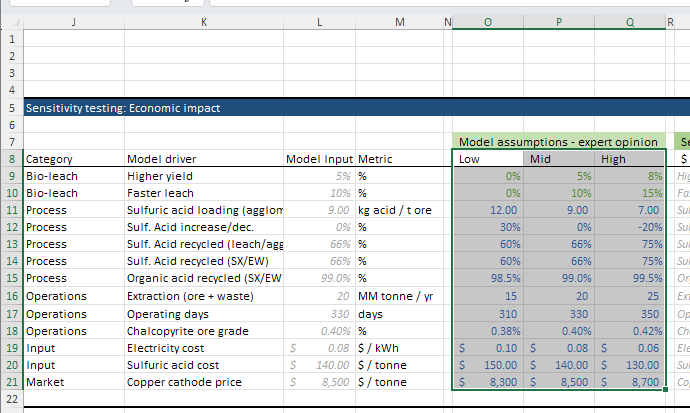
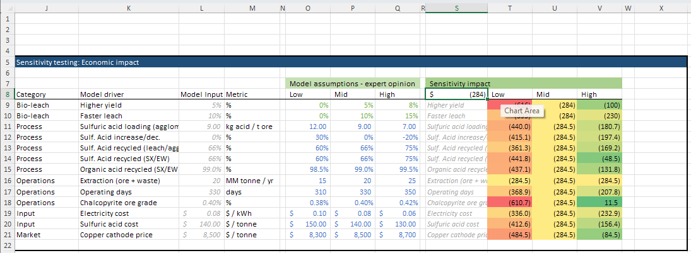

# Troubleshooting

This section provides guidance for troubleshooting common issues you might encounter with the TEA model.

## General Approach to Troubleshooting

When encountering issues in the model, track where the error is originating from whether in the same or different sheet:

1. For #REF errors:
    - Check for circular references
    - Verify that all referenced cells exist
    - Ensure formulas are pointing to valid ranges
    - Check for deleted sheets or renamed ranges
2. For unexpected results:
    - Trace dependencies via "Formulas" → "Trace Dependents" or "Trace Precedents"
    - Check units consistently throughout calculations

## Tornado Chart Issues

When troubleshooting sensitivity analysis and tornado chart issues:

- Ensure that the sensitivity table (column B → P) mirror the dashboard via formulas
    
    ??? example "View Sensitivity Table"
        
    
- Make sure the calculations for the low-to-high deltas are correct and not error-ing out
    
    ??? example "View Low-to-High Deltas"
        
    
- Check the 'creating chart' section to identify where there could be issues
    
    ??? example "View Chart Generation Details"
        
    
- If two drivers have exactly the same impact across low-to-high, there results in 2 levers at the same rank, and creates an error for the tornado chart. To fix - tweak the input assumptions slightly so there isn't an exact duplicate
    
    ??? example "View Duplicate Impact Example"
        
    

For other tips, refer to best practices ([reference](https://www.f1f9.com/wp-content/uploads/2019/05/F1F9_TornadoCharts_EBook_03a.pdf))

## Data Table Issues

Tips for working with and troubleshooting data tables:

- Ensure that data tables reference the Row Input and Column Input cells. It doesn't actually matter which cells are referenced, but we set these here on the side to avoid accidentally setting cells that could be populated with other values. These reference cells just need to be kept clean and separated.
    
    ??? example "View Data Table References"
        
    
- Ensure parameter ranges (low, base, high) are properly defined
    
    ??? example "View Parameter Ranges"
        
    
- Check that the output metric is referenced correctly in the top left corner of the data table (columns S through V in this example)
    
    ??? example "View Output Metric Reference"
        
    

## Adapting the Model to Your Specific Context

For technology-specific adaptations:

- Identify key differentiating factors of your biotechnology
- Focus on parameterizing those specific advantages
- Create additional calculation sections if needed
- Consider creating custom sensitivity analyses for your key innovation parameters

If you encounter persistent issues that you can't resolve, feel free to reach out -- you can find our contact information in the [home page](index.md#contact-information).
