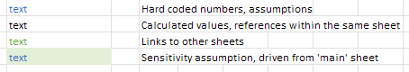

# Cover Sheet

The cover sheet gives a high-level overview of the TEA, and also has contact information if you'd like to reach out with feedback or questions.

You'll see that different numeric assumptions are color-coded differently. We use best practices adopted by finance and accounting analysts for building easy-to-audit models.

??? example "View Color Coding Example"
    

## Color Coding Key

- **Blue** cells contain input assumptions that can be modified directly
- **Green** cells contain values derived from other sheets or sections
- **Black** cells contain calculations or references
- **Gray** (italicized) cells contain intermediate or reference calculations

This consistent color coding helps users quickly understand which cells they should modify versus which contain formulas or derived values. 
