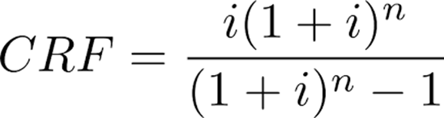

# Economic Assumption Sheets

The economic sheets contain all the cost and revenue assumptions for the TEA model.

## "Variable" Sheet

This sheet provides a detailed breakdown of variable costs, both COGS (Cost of Goods Sold) and OpEx (Operating Expenses):

- Reagent costs (acid, extractants, etc.)
- Labor requirements and costs
- Consumables and replacement parts

When modifying this sheet for your technology, ensure that you update the relevant reagent costs, consumption rates, and any other variable costs that your technology might impact.

## "CapEx" Sheet

This sheet details capital expenditures for each unit operation, with a framework to aggregate and annualize costs.

### CapEx Overhead

- Uses an illustrative breakdown designed more for chemical plants than mining for two reasons:
    1. The processing steps resemble a chemical manufacturing process more than extraction
    2. There's more literature and finer parameterization around indirect/auxiliary cost breakdowns

### Install Factors

- Given the roughness of CapEx estimates, install factors are kept illustrative
- Can be adjusted based on specific site conditions and equipment types

### Annualizing CapEx

- We use a capital recovery factor approach to estimate annual CapEx cost, instead of a discounted cash flow

??? example "View Capital Recovery Factor Calculation"
    

- Capital Recovery Factor ([ref](https://en.wikipedia.org/wiki/Capital_recovery_factor)) - estimates the percentage of initial principal payment needed annually
- Requires only two inputs: number of payment periods (years) and annual interest rate
- Trade-off: Simpler annualized CapEx estimate that's more easily auditable vs. a full discounted cash flow (DCF) sheet
- Uses a weighted average cost of capital (WACC) that blends equity and debt costs
- Standard TEAs often assume a 10% discount rate, which we parameterize further

### Unit Operation Equipment Costs

- Identifies major pieces of equipment for each unit operation
- Illustrative costs
- Scales equipment based on throughput using appropriate scaling factors

## "Sales" Sheet

This sheet contains assumptions related to copper pricing and revenue generation:

- Historical and projected copper prices
- Revenue calculations based on production volume and price

When customizing this sheet, you may want to update the copper price assumptions based on your specific market outlook or time horizon. 
