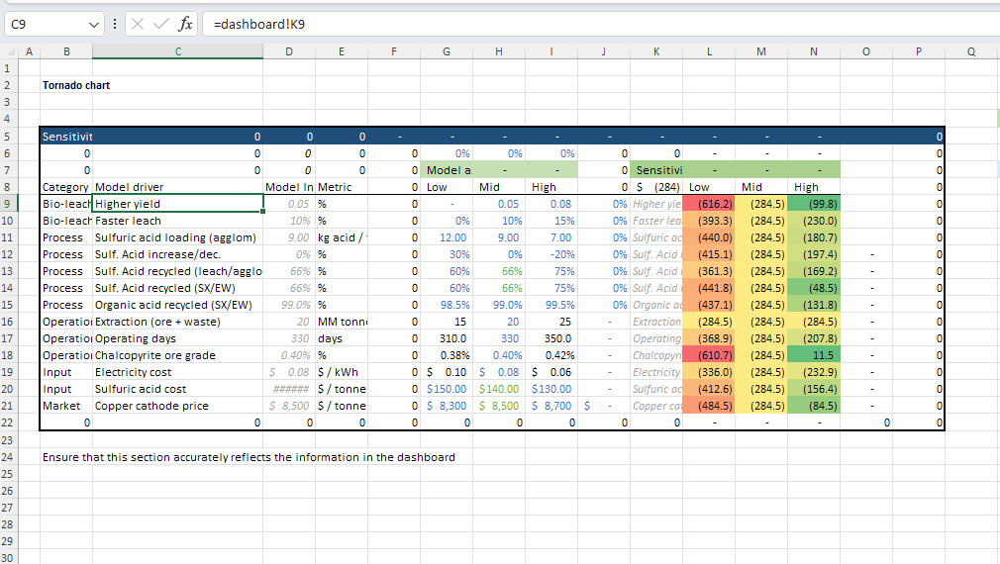
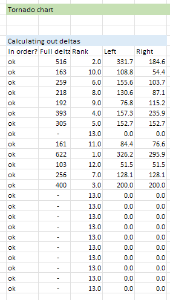
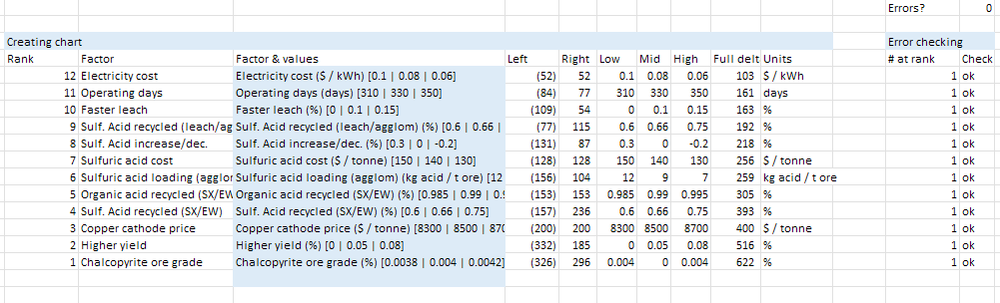
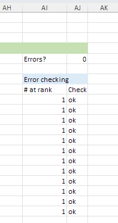

# Utility Sheets

The utility sheets provide additional analysis and validation for the TEA model.

## "Tornado" Sheet

This sheet contains Excel formulas that drive the tornado chart visualization:

- Calculates sensitivity impacts for each parameter
- Ranks parameters by impact magnitude
- Generates data for the tornado chart visualization

??? example "View Tornado Chart"
    

The tornado sheet contains several sections:

- Calculations for the low-to-high deltas of each parameter
- Ranking of parameters by impact
- Chart generation formulas

??? example "View Low-to-High Deltas Calculation"
    

??? example "View Chart Generation Details"
    

When modifying this sheet, be careful with the formulas, as they're interconnected. If two drivers have exactly the same impact across low-to-high, there results in 2 levers at the same rank, which creates an error for the tornado chart. To fix this, tweak the input assumptions slightly so there isn't an exact duplicate.

??? example "View Duplicate Impact Problem Example"
    

## "Validation" Sheets

These sheets provide comparison across mining-related reference models from public sources:

- Benchmarking against public mining project data
- Comparative metrics from NI 43-101 reports and other public materials
- Sanity checks for key parameters
- Industry averages and standards for reference

These sheets contain the raw data sources that feed into the summary comparisons on the main validation sheet. Refer to these if you want to understand the context of a specific reference number or explore more detailed benchmark data.

When using these validation sheets:

- Compare your modified assumptions against industry benchmarks
- Use discrepancies as opportunities to validate your assumptions
- Document your reasoning if your values differ significantly from benchmarks 
